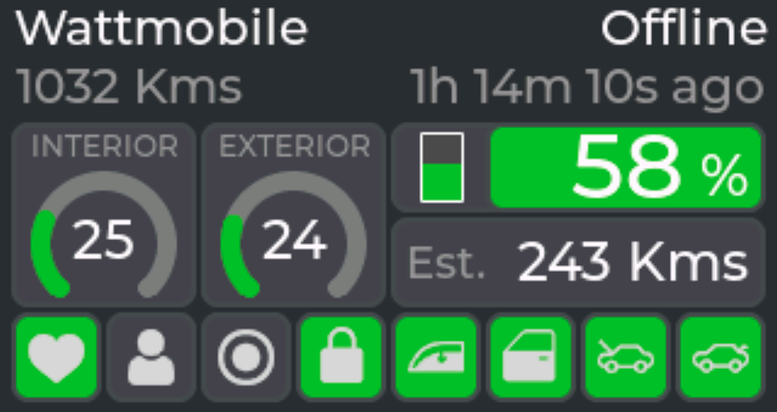

# TeslaMate Companion dashboard

## Description
This is a repo containing raw code to run a small Tesla remote dashboard on your desk. The purpose of this is to have basic information about your car at a glance without the need to open the smartphone app or your browser.

Is it useful? Who knows but it has it's use for me.

## Functions
- State of the car (Online, Offline, Asleep, Driving, Charging, Updating)
- Odometer (Kilometers or Miles)
- Last update timestamp
- Inside/Outside temperature (Celsius or Farhenheit)
- Status of the car (healthy, locked, sentry, presence, doors, windows, trunk and frunk)
- Battery level
- Estimated range

## Requirement
- [PlatformIO in VSC](https://platformio.org/)
- [Lilygo T-Display S3](https://www.lilygo.cc/products/t-display-s3)
- [TeslaMate](https://github.com/teslamate-org/teslamate)
- [TeslaMateApi](https://github.com/tobiasehlert/teslamateapi)

## Instructions
- Clone the repo
- Open it in VSC (that has PlatformIO)
- Tune the main.cpp with your variables
- Connect your T-Display S3 and upload
- Enjoy

## Technical notes
- RemoteDebug: you can `telnet ip` to get the serial output
- OTA update: you can remotely update the T-Display by uncommenting the last line in [platformio.ini](./platformio.ini)

## Variables

All variables are in [main.cpp](./src/main.cpp). Code is compatible with TeslaMateApi behind a basic auth such as when you deploy TeslaMate using docker with Traefik.

| Name | Default value | Description
|:-:|:-:|--|
|`WIFI_SSID`||Name of your wifi network|
|`WIFI_PASS`||Password of your wifi network|
|`WIFI_TIMEOUT`|`5`|Number of seconds to reset the wifi setting when (re)connecting in seconds|
|`API_URL`||URL of TeslaMateApi, usually `https://somedomain/api/v1/cars/1/status`|
|`API_TIMEOUT`|`2`|Timeout before dropping the GET attempt in seconds|
|`API_AUTH`|`true`|Indicate if your TeslaMateApi need auth (TeslaMate installed with a basic auth by Traefik for example)|
|`API_USER`||If `API_AUTH`, user of TeslaMate|
|`API_PASS`||If `API_AUTH`, password of TeslaMate|
|`TZ_OFFSET`|`1`|Hours of offset against GMT (1 is France Summer)|
|`POLLING_INTERVAL`|`30`|Frequency of data refresh in seconds|
|`HOSTNAME`|`TeslaMateCompanion`|Broadcasted network name of the device|