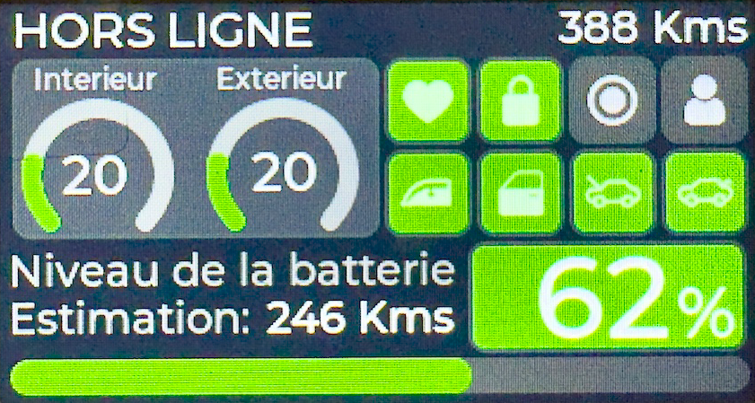

# TeslaMate Companion dashboard



**WARNING: THIS WILL MOST LIKELY NOT WORK EASILY AS IT REQUIRE A PRECISE ENV.**

## Description
This is a repo containing raw code to run a small Tesla remote dashboard on your desk. The purpose of this is to have basic information about your car at a glance without the need to open the smartphone app or your browser.

Is it useful? No one can answer that but it has it's use for me.

I won't adapt it to make it work for everyone since no one will read this. More like a memo for me.

Plus everything is in baguette for once.

## Functions
- State of the car
- Odometer
- Inside/Outside temperature
- Status of the car (healthy, locked, sentry, presence, doors, windows, trunk and frunk)
- Battery level
- Estimated range

## Requirement
- [PlatformIO in VSC](https://platformio.org/)
- [Lilygo T-Display S3](https://www.lilygo.cc/products/t-display-s3)
- [TeslaMate](https://github.com/teslamate-org/teslamate)
- [TeslaMateApi](https://github.com/tobiasehlert/teslamateapi)
- [n8n](https://github.com/n8n-io/n8n)
  - Running a custom workflow with basically a get to TeslaMateApi and reformat the JSON to a barebone one using the code node.
  - Workflow as `Webhook` > `HTTP Get to TeslaMateApi` > `Code` > `Respond to webhook`).
  - Code contain:
  ```
  payload = $input.first().json.data;

  return {
    "state": state,
    "since": payload.status.state_since,
    "odometer": Math.round(payload.status.odometer).toString(),
    "battery": {
      "level": payload.status.battery_details.battery_level.toString(),
      "range": Math.round(payload.status.battery_details.est_battery_range).toString()
    },
    "temp": {
      "inside": Math.round(payload.status.climate_details.inside_temp).toString(),
      "outside": Math.round(payload.status.climate_details.outside_temp).toString()
    },
    "status": {
      "healthy": payload.status.car_status.healthy,
      "locked": payload.status.car_status.locked,
      "sentry": payload.status.car_status.sentry_mode,
      "windows": payload.status.car_status.windows_open,
      "doors": payload.status.car_status.doors_open,
      "trunk": payload.status.car_status.trunk_open,
      "frunk": payload.status.car_status.frunk_open,
      "present": payload.status.car_status.is_user_present
    }
  }
  ```